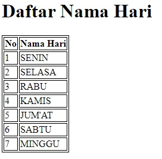
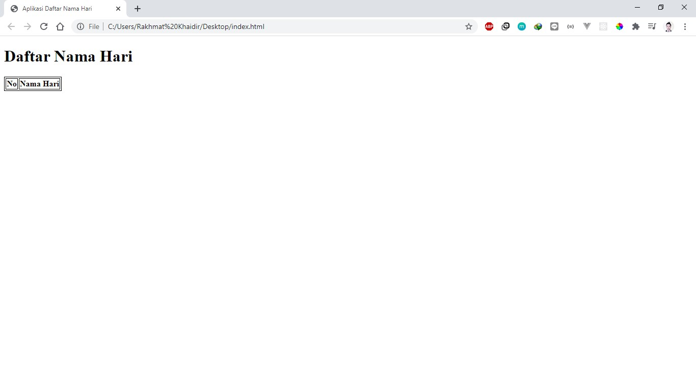
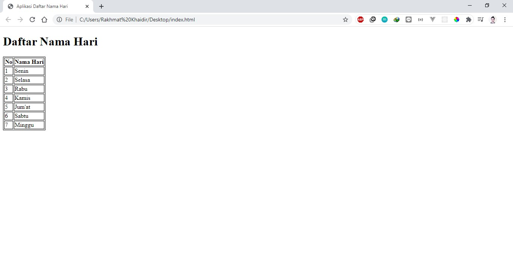

# Codelab Perulangan

Setelah kita mempelajari tentang macam-macam perulangan pada bahasa pemrograman PHP selanjutnya kita akan latihan senderhana yaitu membuat aplikasi menampilkan nama-nama hari, sebagai contoh aplikasi pada gambar berikut:



---

## Membuat Tampilan Aplikasi

Pertama-tama buat sebuah berkas bernama ```index.php``` lalu tuliskan kode program berikut:

```html
<!DOCTYPE html>
<html>
    <head>
        <title>Aplikasi Daftar Nama Hari</title>
    </head>
    <body>

    <body>
</html>
```

Pada bagian body buat heading dengan judul Daftar Nama Hari dan sebuah tabel sebagai berikut:

```html
<!DOCTYPE html>
<html>
    <head>
        <title>Aplikasi Daftar Nama Hari</title>
    </head>
    <body>
        <h1>Daftar Nama Hari</h1>
        <table>
            <thead>
                <tr>
                    <th>No</th>
                    <th>Nama Hari<th>
                <tr>
            </thead>
            <tbody>

            </tbody>
        <table>
    <body>
</html>
```

Tambahkan CSS untuk memberikan border pada tabel pada bagian head.

```html
<head>
	...
    <style>
        table {
            border: 1px solid black;
        }

        tr, th, td {
            border: 1px solid black;
        }
    </style>
</head>
```

Sekarang buka aplikasi pada browser maka akan tampil judul Daftar Nama Hari dan sebuah tabel



---

## Menampilkan Daftar Nama Hari

Setelah kita membuat tampilan aplikasi sekarang kita akan membuat daftar nama hari dan menampilkannya pada tabel.

Pertama-tama buat sebuah variabel bernama ```days``` dan bertipe array yang menyimpan nama hari di atas tabel.

```php
...
<?php
$days = ["Senin", "Selasa", "Rabu", "Kamis", "Jum'at", "Sabtu", "Minggu"];
?>
<table>
...
</table>
```

Setelah itu kita tampilan daftar nama hari tersebut di dalam tag ```<tbody>``` menggunakan perulangan. Pilih salah satu dari perulangan tersebut.

**Perulangan for**

```php
...
<tbody>
<?php
for($i=0; $i< count($days); $i++) {
?>
    <tr>
        <td><?php echo $i+1; ?></td>
        <td><?php echo $days[$i]; ?></td>
    </tr>
<?php
}
?>
</tbody>
...
```

**Perulangan while**

```php
...
<tbody>
<?php
$i = 0;
while($i < count($days)) {
?>
    <tr>
        <td><?php echo $i+1; ?></td>
        <td><?php echo $days[$i]; ?></td>
    </tr>
<?php
    $i++;
}
?>
</tbody>
...
```

**Perulangan do...while**

```php
...
<tbody>
<?php
$i = 0;
do {
?>
    <tr>
        <td><?php echo $i+1; ?></td>
        <td><?php echo $days[$i]; ?></td>
    </tr>
<?php
$i++;
} while($i < count($days));
?>
</tbody>
...
```

**Perulangan foreach**

```php
...
<tbody>
<?php
$i = 1;
foreach($days as $value) {
?>
    <tr>
        <td><?php echo $i++; ?></td>
        <td><?php echo $value; ?></td>
    </tr>
<?php
}
?>
</tbody>
...
```

Sekarang buka aplikasi pada browser maka akan tampil daftar nama hari pada tabel.

